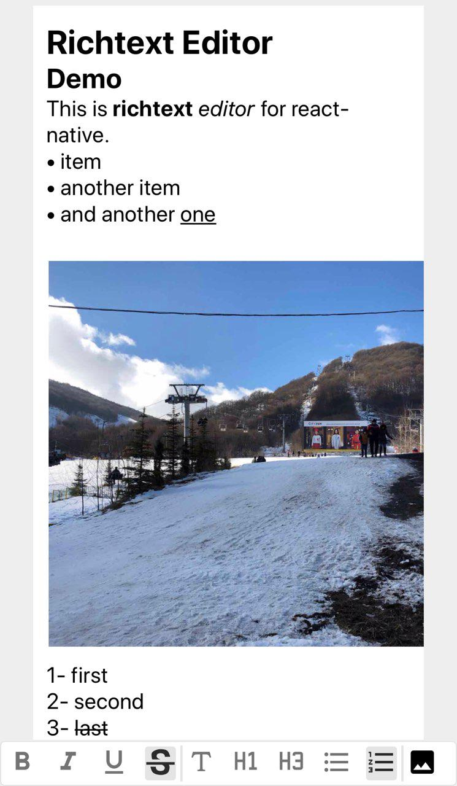

# react-native-cn-richtext-editor

Richtext editor for react native



## Installation


#### Install using npm:

```
npm i react-native-cn-richtext-editor
```
#### Install using yarn:

```
yarn add react-native-cn-richtext-editor
```
### Usage

Here is an  overview of the components usage.

```
import React, { Component } from 'react';
import { View, StyleSheet, Keyboard
, TouchableWithoutFeedback
, KeyboardAvoidingView, Platform } from 'react-native';
import  CNRichTextEditor , { CNToolbar, getInitialObject  } from "react-native-cn-richtext-editor";

export default class App extends Component {

    constructor(props) {
        super(props);

        this.state = {
            selectedTag : 'body',
            selectedStyles : [],
            value: [getInitialObject()]
        };

        this.editor = null;  
    }

    onStyleKeyPress = (toolType) => {
        if (toolType !== 'image') {            
            this.editor.applyToolbar(toolType);
        }
        else {
        // Handling image ...
        }
    }
    
  onSelectedTagChanged = (tag) => {
    this.setState({
        selectedTag: tag
    })
  }

  onSelectedStyleChanged = (styles) => {  
    this.setState({
        selectedStyles: styles
    })
}

onValueChanged = (value) => {
    this.setState({
        value: value
    });
}

render() {
    return (
        <KeyboardAvoidingView
        behavior={Platform.OS == 'ios' ? "padding" : null} 
        enabled
        keyboardVerticalOffset={0}
        style={{
            flex: 1,
            paddingTop: Platform.OS == 'ios' ? 20 : 0,
            backgroundColor:'#eee',
            flexDirection: 'column', 
            justifyContent: 'flex-end'
        }}>
        <TouchableWithoutFeedback onPress={Keyboard.dismiss} >             
                <View style={styles.main}>
                    <CNRichTextEditor                   
                        ref={input => this.editor = input}
                        onSelectedTagChanged={this.onSelectedTagChanged}
                        onSelectedStyleChanged={this.onSelectedStyleChanged}
                        value={this.state.value}
                        onValueChanged={this.onValueChanged}
                        style={{ backgroundColor : '#fff', padding : 10}}
                    />                      
                </View>
        </TouchableWithoutFeedback>

        <View style={{
            minHeight: 35
        }}>
            <CNToolbar
                selectedTag={this.state.selectedTag}
                selectedStyles={this.state.selectedStyles}
                onStyleKeyPress={this.onStyleKeyPress} />
        </View>
    </KeyboardAvoidingView>
    );
}
}

var styles = StyleSheet.create({
    main: {
        flex: 1,
        paddingTop: 0,
        paddingLeft: 30,
        paddingRight: 30,
        paddingBottom: 1,
        alignItems: 'stretch',

    },
});

```
## Props

### CNRichTextEditor

| Name | Description |
| ------ | ----------- |
| onSelectedTagChanged   | this prop triggers when selected tag of editor is changed. |
| onSelectedStyleChanged | this prop triggers when selected style of editor is changed. |
| value    | javascript array object which keeps value of textinput |

### CNToolbar

| Name | Required | Description |
| ------ | ------ | ----------- |
| selectedTag   | Yes | selected tag of RichTextEditor. |
| selectedStyles | Yes | selected style of RichTextEditor |
| onStyleKeyPress    |  Yes | this event will be triggered when user press one of toolbar keys. |
|  size  | No  | font size of toolbar buttons  |
| bold  |  No | child component of bold button. you can use it to set an icon for bold button ( see expo-demo app) |
|  italic | No  | child component of italic button   |
| underline  | No  | child component of underline button  |
| lineThrough  | No  | child component of lineThrough button  |
| body  | No  | child component of body button |
| title  | No  | child component of title button   |
| ul  | No  | child component of ul button |
| ol  | No  | child component of ol button |
| image  | No  | child component of image button  |


### Functions
| Name | Param | Returns | Description |
| ------ | ------ | ------ |----------- |
| getInitialObject | - | javascript object  | create a initial value for RichTextEditor. |
| convertToHtmlString | array | string  | this function converts value of RichTextEditor to html string (use it to keep value as html in db) |
| convertToObject | string | array | converts html back to array for RichTextEditor value (use this function only for html string created by convertToHtmlString function)  |

## Expo Demo App
Checkout the
[expo-demo App](https://expo.io/@imnapo/expo-demo)
on Expo which uses react-native-cn-richtext-editor components.
If you are looking to test and run expo-demo App locally, click
[here](https://github.com/imnapo/react-native-cn-richtext-editor/tree/master/expo-demo) to
view the implementation & run it locally.

